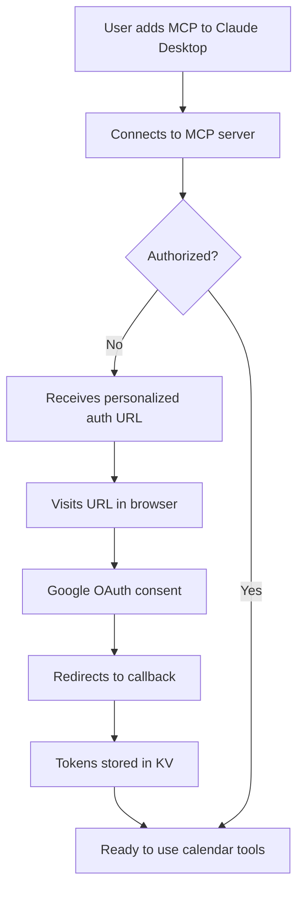
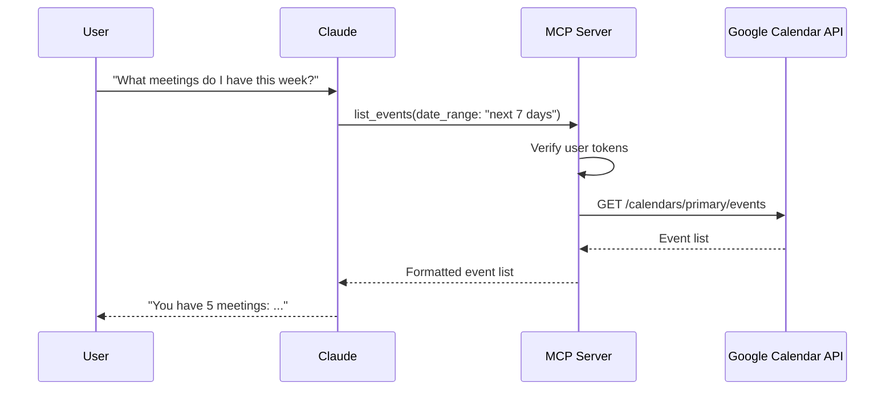
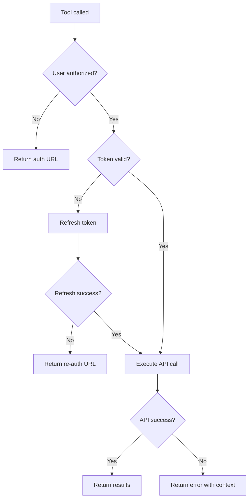

# PRD: Google Calendar MCP Server

## 0. Metadata

| Attribute | Details |
| :--- | :--- |
| **Author** | Geoff (Sense and Motion) |
| **Status** | 🟡 Draft |
| **Priority** | P0 |
| **Target Release** | MVP (no fixed timeline) |

---

## 1. Problem & Opportunity (The "Why")

### The Problem

Users working with Claude Desktop want calendar awareness to help with scheduling, meeting preparation, and capacity planning. Currently, there's no way for Claude to access calendar data, forcing users to:

- Context-switch to Google Calendar in a browser to check availability
- Manually relay meeting information to Claude for planning discussions
- Track meeting history separately for timeline reconstruction
- Miss opportunities for Claude to proactively surface relevant context ("You have BC Hydro in 30 minutes")

### The Evidence

- Users managing multiple client engagements need to reconstruct timelines ("When did we last meet with Terry?")
- Scheduling assistance requires manual calendar checking ("When am I free for the workshop?")
- Meeting prep would benefit from automatic context linking to work tracking systems
- Capacity planning discussions lack visibility into actual meeting load

### The Opportunity

An MCP server that connects Claude Desktop to Google Calendar would enable:

- **Proactive scheduling assistance:** "When are you free this week?" gets real answers
- **Timeline reconstruction:** Pull historical meeting data to establish context
- **Capacity awareness:** Surface meeting load during effort estimation discussions
- **Seamless event creation:** Schedule follow-ups without leaving Claude
- **Generic utility:** Anyone can deploy and use it with their own Google account

---

## 2. Key Decisions & Trade-offs (Alignment)

### Decision: Cloudflare-Hosted Multi-User Service

**Trade-off:** Could build a local MCP server with local credential storage (simpler architecture), but chose Cloudflare Workers deployment for easier distribution.

**Rationale:**
- Users just add an MCP endpoint URL to their config
- No local installation, no platform-specific builds
- Single maintained deployment benefits all users
- OAuth flow handled server-side (cleaner than CLI device flow)

**Implication:** Requires Cloudflare KV for token storage, adds hosting complexity.

---

### Decision: Google Calendar Only (No Microsoft/Other)

**Trade-off:** Broader provider support would reach more users, but increases complexity significantly.

**Rationale:**
- Google Calendar API is well-documented and stable
- OAuth flow is straightforward
- Focus on quality over breadth for MVP
- Can add providers later if demand warrants

**Implication:** Microsoft 365 users cannot use this MCP.

---

### Decision: Limited Write Operations (Create + Move, No Delete)

**Trade-off:** Full calendar management would be more powerful, but too risky for agent operations.

**Rationale:**
- Deleting events is destructive and hard to undo
- Editing event descriptions overlaps with external note-taking systems
- Create + Move covers the primary scheduling use cases

**Implication:** Users must delete events manually in Google Calendar.

---

### Decision: 90-Day Historical Window

**Trade-off:** Unbounded historical access vs. bounded window.

**Rationale:**
- 90 days covers most "when did we last meet?" queries
- Reduces API load and response sizes
- Balances utility with performance

**Implication:** Cannot query meetings from >90 days ago (can expand if needed).

---

## 3. Functional Requirements (The "What")

### FR-001: Multi-User OAuth Authentication

**Description:** The system must support multiple users, each authenticating with their own Google account via OAuth 2.0, with strict security isolation between users.

**Acceptance Criteria:**
- Given a new user connects to the MCP server
- When they attempt to use a calendar tool
- Then they receive a personalized authorization URL including their MCP identity
- And their Google tokens are encrypted at rest using AES-256-GCM
- And encryption keys are stored in Cloudflare Secrets (not KV)
- And tokens are stored in KV keyed by a cryptographically secure user identifier
- And tokens automatically refresh when expired
- And each request validates user identity before retrieving tokens
- And no user can access another user's tokens or calendar data under any circumstances

---

### FR-002: List Events with Filters

**Description:** Users must be able to retrieve a list of calendar events with flexible filtering options.

**Acceptance Criteria:**
- Given a user has authorized their Google account
- When they request events with a date range (e.g., "next 7 days")
- Then the system returns all events in that range from all their calendars
- And supports filtering by specific calendar ID
- And supports keyword search in event titles/descriptions
- And supports filtering by attendee email
- And defaults to 7 days if no range specified
- And can query past events up to 90 days historical

---

### FR-003: Get Event Details

**Description:** Users must be able to retrieve full details for a specific calendar event.

**Acceptance Criteria:**
- Given a user provides an event ID
- When they request event details
- Then the system returns:
  - Event title
  - Start and end time (with timezone)
  - Attendees (names/emails)
  - Location
  - Description/notes
  - Calendar name/ID
  - Recurring event metadata (if applicable)

---

### FR-004: Search Events by Keyword

**Description:** Users must be able to search across all events using keyword queries.

**Acceptance Criteria:**
- Given a user searches for "Rennie"
- When the search executes
- Then the system returns all events matching the keyword in title or description
- And searches across all accessible calendars
- And defaults to future events (can include past with flag)

---

### FR-005: Search Events by Attendee

**Description:** Users must be able to find all events involving a specific person.

**Acceptance Criteria:**
- Given a user searches for attendee "terry@example.com"
- When the search executes
- Then the system returns all events where that email is an attendee
- And works with partial email matches or names
- And includes both past (90 days) and future events

---

### FR-006: Free/Busy Query

**Description:** Users must be able to check their own availability for scheduling purposes.

**Acceptance Criteria:**
- Given a user requests free/busy for a date range
- When the query executes
- Then the system returns time blocks marked as "busy" or "free"
- And only queries the user's own calendar (not other people's availability)
- And respects calendar visibility settings

---

### FR-007: Create Calendar Event

**Description:** Users must be able to create new calendar events.

**Acceptance Criteria:**
- Given a user provides event details (title, start time, end time)
- When they create an event
- Then the system creates the event in the specified calendar (or default)
- And optionally accepts: attendee emails, location, description
- And returns the created event ID and confirmation
- And handles timezone correctly

---

### FR-008: Move/Reschedule Event

**Description:** Users must be able to reschedule existing events to a new time.

**Acceptance Criteria:**
- Given a user provides an event ID and new start/end times
- When they reschedule the event
- Then the system updates the event's time
- And preserves all other event details (attendees, description, etc.)
- And returns confirmation with the updated event details

---

### FR-009: Auto-Detect All Calendars

**Description:** The system must automatically expose all calendars the user has access to.

**Acceptance Criteria:**
- Given a user has multiple Google calendars (work, personal, shared)
- When they query events
- Then the system includes events from all accessible calendars
- And allows filtering by specific calendar ID
- And returns calendar name/ID with each event for context

---

### FR-010: Recurring Event Handling

**Description:** The system must handle recurring events gracefully, surfacing individual instances within the requested date range.

**Acceptance Criteria:**
- Given a user has a weekly recurring meeting
- When they query events for a date range
- Then the system returns each instance of the recurring event in that range as a separate event
- And includes metadata indicating it's part of a recurring series
- And does not require special handling vs. one-time events

---

## 4. Non-Goals (Out of Scope)

### Explicitly NOT Building

1. **Delete Events** - Too destructive for agent operations; users must delete manually in Google Calendar
2. **Edit Event Descriptions** - Overlaps with external note-taking systems; create new or use Google Calendar directly
3. **Attendee Management** - Adding/removing invitees, managing RSVPs (defer to future version)
4. **Event Attachments** - Uploading/downloading files attached to events
5. **Calendar Sharing/Permissions** - Managing who can access which calendars
6. **Other People's Free/Busy** - Only query the user's own availability (coordinating across multiple people's calendars is complex)
7. **Microsoft 365 / Outlook Support** - Google Calendar only.
8. **Anchored/Repeated Notifications** - Event reminders are handled by Google Calendar app
9. **Real-time Sync** - Events are fetched on-demand, not streamed
10. **Publishing to MCP Registry** - Focus on working solution first
11. **Integration with Specific Systems** - This is a generic calendar MCP; integrations (like with work management systems) are left to client applications

---

## 4.5. Security Requirements

### Critical Security Principles

This MCP server handles sensitive user authentication tokens and calendar data. Security is paramount.

### SEC-001: Encrypted Token Storage

**Requirement:** All OAuth tokens (access tokens, refresh tokens) MUST be encrypted at rest.

**Implementation:**
- Use AES-256-GCM encryption for all tokens before storing in KV
- Encryption keys stored in Cloudflare Secrets (environment variables), never in KV
- Each token encrypted with a unique initialization vector (IV) stored alongside ciphertext
- Token format in KV: `{iv: string, ciphertext: string, tag: string}`

**Rationale:** Cloudflare KV is not designed for secrets storage. Encrypting tokens ensures that even if KV is compromised, tokens remain protected.

---

### SEC-002: Provable Multi-User Segregation

**Requirement:** The system MUST guarantee complete isolation between users with no possibility of cross-account access.

**Implementation:**
- Each MCP request includes a verified user identity (from MCP OAuth session)
- User identity is cryptographically tied to their token storage key
- Token retrieval validates: `requesting_user_id === token_owner_id`
- No wildcard or batch token operations (each token access is explicit and validated)
- Log all token access attempts with user IDs for audit trail

**Security Model:**
```
MCP Request → Extract MCP User Identity → Validate Session →
Compute Token Key (hash of user ID) → Retrieve Encrypted Token →
Decrypt → Verify Token Ownership → Use Token for Google API
```

**Attack Prevention:**
- Session hijacking: MCP OAuth session must be validated on every request
- Token enumeration: KV keys use HMAC of user identity (not predictable)
- Replay attacks: Tokens tied to session; session expiry invalidates token usage
- Cross-user access: Explicit validation that requesting user owns the token

**Audit & Monitoring:**
- Log all authentication events (successful auth, token refresh, auth failures)
- Log any token access where `requesting_user_id ≠ token_owner_id` (should never happen)
- Alert on suspicious patterns (rapid token access, failed validations)

---

### SEC-003: Token Rotation & Expiry

**Requirement:** Tokens must have limited lifetime and be rotated regularly.

**Implementation:**
- Respect Google OAuth token expiry (typically 1 hour for access tokens)
- Proactively refresh tokens before expiry (when < 5 minutes remaining)
- Store token expiry timestamp (encrypted) alongside tokens
- If refresh fails, invalidate stored token and require re-authentication
- Never expose raw tokens in logs or error messages

---

### SEC-004: Secure Credential Transmission

**Requirement:** All credential flows must use secure channels.

**Implementation:**
- OAuth callback uses HTTPS only (enforced by Cloudflare Workers)
- Authorization codes are single-use and expire after exchange
- State parameter includes CSRF token to prevent authorization code injection
- No credentials passed via URL query parameters (use POST body or headers)

---

### SEC-005: Minimal Scope & Least Privilege

**Requirement:** Request only the minimum necessary Google Calendar scopes.

**Implementation:**
- Scope requested: `https://www.googleapis.com/auth/calendar` (read + create + update)
- Do NOT request: admin scopes, domain-wide delegation, contacts, email, or other Google APIs
- Explicitly document why `calendar` scope is needed (vs. `calendar.readonly`)

---

## 5. Technical Constraints & Assumptions

### Constraints

1. **Must run on Cloudflare Workers** - No local server process, must fit within Workers execution model
2. **Must use Cloudflare KV for encrypted token storage** - Token storage limited to KV semantics (eventual consistency, size limits); tokens MUST be encrypted at rest
3. **Must use Cloudflare Secrets for encryption keys** - Encryption keys stored as environment variables, never in KV or code
4. **Workers CPU Limit** - 50ms CPU time on free tier; must keep operations fast (encryption adds minimal overhead)
5. **Google Calendar API Rate Limits** - Subject to Google's quota (1000 queries per 100 seconds per user)
6. **OAuth Scope** - Must request `https://www.googleapis.com/auth/calendar` scope (includes read, create, update)
7. **Multi-User Isolation** - Each user's tokens must be cryptographically isolated; no cross-account access possible
8. **MCP Protocol Compliance** - Must follow Model Context Protocol specification
9. **Security-First Design** - All authentication and authorization logic must be auditable and provably secure

### Assumptions

1. **Users have Google accounts** - Target audience already uses Google Calendar
2. **Claude Desktop as primary client** - Optimized for Claude Desktop, but should work with any MCP client
3. **Internet connectivity** - Users and Cloudflare Workers have reliable internet access
4. **OAuth consent screen** - Assumes ability to create/configure GCP OAuth consent screen
5. **No offline support** - All operations require active connection to Google Calendar API

---

## 6. Design & Visuals

### MCP Tools Overview

The MCP server exposes the following tools:

| Tool Name | Purpose | Key Parameters |
|-----------|---------|----------------|
| `list_events` | Retrieve events with filters | `date_range`, `calendar_id`, `keyword`, `attendee` |
| `get_event` | Get full details for one event | `event_id` |
| `search_events` | Search by keyword across calendars | `query`, `include_past` |
| `get_free_busy` | Check availability for date range | `start_time`, `end_time` |
| `create_event` | Create a new event | `title`, `start`, `end`, `calendar_id`, `attendees`, `location`, `description` |
| `move_event` | Reschedule an existing event | `event_id`, `new_start`, `new_end` |
| `calendar_auth_status` | Check if Google account is connected | (none) |

### User Flow: First-Time Setup



### User Flow: Querying Events



### Error Handling Flow



---

## Implementation Notes

### OAuth Scopes Required

- **Read operations:** `https://www.googleapis.com/auth/calendar.readonly`
- **Write operations:** `https://www.googleapis.com/auth/calendar`

**Decision:** Request `calendar` scope from the start (includes read access) to avoid re-authorization when adding write features.

### Token Storage & Encryption

**KV Key Format:**
```
google_tokens:{HMAC-SHA256(user_id)}
```

**Encrypted Token Structure:**
```typescript
{
  iv: string,              // Base64-encoded initialization vector
  ciphertext: string,      // Base64-encoded encrypted token data
  tag: string,             // Base64-encoded authentication tag (GCM)
  user_id_hash: string,    // For validation (non-reversible)
  created_at: number,      // Unix timestamp
  expires_at: number       // Unix timestamp (encrypted field duplicated for quick checks)
}
```

**Encryption Keys (Cloudflare Secrets):**
- `TOKEN_ENCRYPTION_KEY` - 256-bit key for AES-256-GCM (hex-encoded)
- `TOKEN_HMAC_KEY` - 256-bit key for HMAC-SHA256 KV key generation (hex-encoded)

**Decrypted Token Data:**
```typescript
{
  access_token: string,
  refresh_token: string,
  expires_at: number,      // Unix timestamp
  scope: string,
  user_email: string,      // For logging/debugging
  user_id: string          // MCP user identity
}
```

### Session Validation Flow

Every MCP tool call must:
1. Extract MCP user identity from request context
2. Compute KV key: `google_tokens:${HMAC(user_id)}`
3. Retrieve encrypted token from KV
4. Verify `user_id_hash` matches `HMAC(requesting_user_id)`
5. Decrypt token using `TOKEN_ENCRYPTION_KEY`
6. Verify decrypted `user_id` matches requesting user
7. Check token expiry; refresh if needed
8. Use token for Google API call

**Failure modes:**
- No token found → Return auth URL
- Decryption fails → Log error, return auth URL (possible key rotation)
- User ID mismatch → Log critical security error, reject request
- Token expired + refresh fails → Return re-auth URL

### Event Date Ranges

- **Default "upcoming":** Next 7 days
- **Historical limit:** 90 days in the past
- **Future limit:** None (can query years ahead if needed)

### Recurring Event Strategy

Treat each instance as a standalone event in list results, but include `recurringEventId` in metadata so clients can understand the relationship if needed. This "surface instances in range" approach avoids complexity of series management while supporting the primary use cases.

---

## Success Criteria

1. **Multi-user deployment:** At least 3 different users can simultaneously use the same MCP endpoint with isolated tokens
2. **Reliable authentication:** OAuth flow succeeds on first attempt, tokens refresh automatically
3. **Fast responses:** 95% of queries return within 2 seconds
4. **Accurate data:** Events match Google Calendar web UI exactly (no missing data)
5. **Clear errors:** Authentication failures provide actionable next steps (auth URL, re-authorization guidance)
6. **Security validation:**
   - All tokens stored in KV are encrypted (manual KV inspection shows ciphertext, not plaintext)
   - User A cannot access User B's calendar data (penetration test with 2 accounts)
   - Session hijacking attempts fail (forged user IDs rejected)
   - Encryption keys never appear in logs, KV, or error messages
   - Security audit trail captures all token access events
